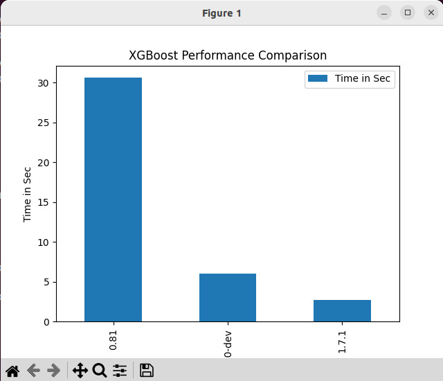

# Benchmarking Intel® Python XGBoost

> XGBoost* is a widely used gradient boosting library in the classical ML area. Designed for flexibility, performance, and portability, XGBoost* includes optimized distributed gradient boosting frameworks and implements Machine Learning algorithms underneath. Starting with 0.9 version of XGBoost, Intel has been up streaming optimizations through the hist histogram tree-building method. Starting with 1.3.3 version of XGBoost and beyond, Intel has also begun up streaming inference optimizations to XGBoost as well.

## Prerequisites

- Anaconda

## Installing various versions of XGBoost

Git clone the repo

```shell
git clone https://github.com/krishnashed/ML-Benchmarking.git
cd ML-Benchmarking
```

### Installing Latest XGBoost

```shell
cd Requirements
conda create -n latest-xgboost python=3.9 pip
conda activate latest-xgboost
pip install -r xgboost-latest-pip.txt
```

### Setting up Optimised XGBoost

```shell
conda create -n optimised-xgboost -c intel intel-aikit-modin
```

### Setting up Unoptimised XGBoost

```shell
conda create -n unoptimised-xgboost --clone optimised-xgboost
conda activate unoptimised-xgboost
conda remove xgboost
pip install xgboost==0.81
```

## Running XGBoost against dataset

Here we run different XGBoost models against the same dataset, to gauge the performance

### Running with Unoptimised XGBoost

```shell
conda activate unoptimised-xgboost
python XGBoost.py
conda deactivate
```

### Running with Optimised XGBoost

```shell
conda activate optimised-xgboost
python XGBoost.py
conda deactivate
```

### Running with Latest XGBoost

```shell
conda activate latest-xgboost
python XGBoost.py
conda deactivate
```

The data is stored in `perf_numbers.csv` file.

```
  XGBoost Version  Time in Sec
0            0.81    30.596804
1       1.6.0-dev     6.003117
2           1.7.1     2.673334
```

Performance increase with higher versions of XGBoost


